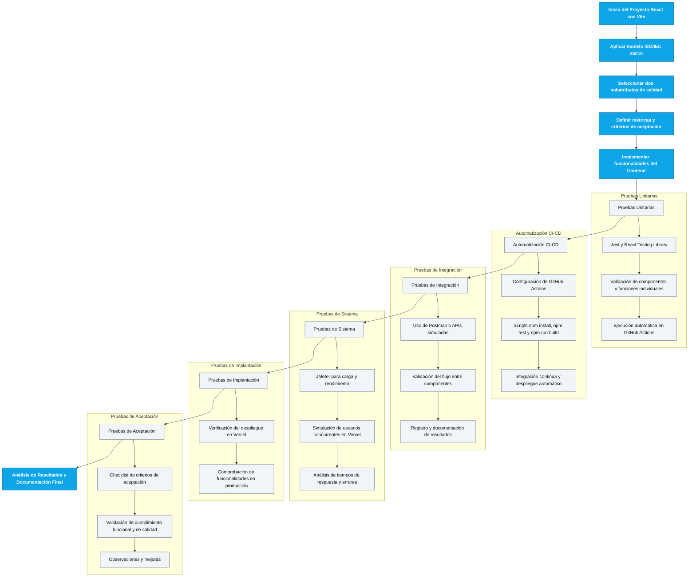

# Proyecto Educativo Multimedia – Colegio Mentes Creativas

## Portada
- Nombre del proyecto: Aplicativo Educativo Multimedia (React + Vite)
- Integrantes del grupo: [Completar]
- Profesor: Mg. Gustavo Sánchez Rodríguez
- Programa: [Completar]
- Ciudad: [Completar]
- Fecha de entrega: 11 de noviembre de 2025

## Introducción
- Proyecto base: Frontend React + Vite con TypeScript, Tailwind, pruebas con Jest.
- Propósito: Documentar calidad, pruebas y despliegue siguiendo ISO/IEC 25010.

## Escenario Asignado y Justificación
- Escenario: Aplicación multimedia para estudiantes de 4° y 5° en matemáticas, ciencias naturales y pensamiento lógico.
- Justificación: Interfaz sencilla, recursos multimedia (animación y 3D) y ejercicios prácticos para aprendizaje lúdico.

## Normas y Modelos de Calidad Aplicados
- Modelo: ISO/IEC 25010.
- Característica aplicada: Eficiencia de rendimiento.
- Subatributos:
  - Comportamiento temporal: medir tiempos de respuesta y renderizado.
  - Capacidad: comportamiento bajo carga concurrente.

## Métricas de Calidad Definidas
- TTR (Time To Render) de vistas clave `< 1.5 s` en Vercel.
- P95 de respuesta bajo 20–50 usuarios concurrentes `< 5 s`, error `< 1%`.
- Método: mediciones con Lighthouse/JMeter y registros de CI.

## Proceso de Despliegue en Vercel
- Conectar repositorio GitHub.
- Framework: `Vite`. Comando: `npm run build`. Directorio: `dist`.
- URL pública: [Completar]
- Evidencias: capturas del dashboard de Vercel y sitio operativo.
 - Última actualización de documento: 2025-11-12

## Pruebas Unitarias Implementadas
- Herramientas: Jest + React Testing Library (`jest.config.js:2-9`).
- Archivos clave: `src/setupTests.ts` configura `jest-dom` y mocks.
- Casos agregados:
  - `src/views/Matematicas.test.tsx`: guía, calculadora y tablas.
  - `src/views/Ciencias.test.tsx`: guía y video, fallback 3D en pruebas.
  - `src/views/Logico.test.tsx`: secuencia y puntaje.
- Ejecución: `npm test`. CI: `.github/workflows/unitaria.yml:40-53`.

## Automatización de CI/CD (GitHub Actions)
- Flujo: instalar dependencias (`npm ci`), `type-check`, `lint`, `test --ci`, `build`.
- Matriz Node: 18/20/22.
- Artifact: `dist` publicado.
- Evidencias: capturas de jobs en GitHub Actions.

## Pruebas de Integración con Postman
- Endpoints públicos para contenido educativo:
  - Matemáticas: `http://numbersapi.com/random/math`.
  - Ciencias: `https://api.open-meteo.com/v1/forecast?...`.
  - Sociales: `https://restcountries.com/v3.1/all`.
- Entregable: colección Postman exportada y resultados (latencia/estructura).

## Pruebas de Sistema con JMeter
- Plan: 10/25/50 usuarios, ramp-up 60 s; rutas `/`, `/matematicas`, `/ciencias`, `/logico`.
- Métricas: P50/P95 tiempos, throughput, error %.
- Evidencias: gráficas y CSV; análisis vs métricas definidas.

## Pruebas de Implantación
- Validación del despliegue en producción (Vercel) y funcionamiento de vistas.
- Navegación fluida sin errores de consola.

## Pruebas de Aceptación – Checklist
| ID | Criterio | Cumple | Observaciones |
|---|---|---|---|
| 1 | Despliegue correcto en Vercel | [ ] | |
| 2 | Carga `< 3s` | [ ] | |
| 3 | Endpoints devuelven datos | [ ] | |
| 6 | Navegación fluida | [ ] | |
| 7 | Sin errores visibles en consola | [ ] | |
| 8 | Unitarias pasan en pipeline | [ ] | |
| 9 | Integración Postman exitosa | [ ] | |
| 10 | JMeter dentro de límites | [ ] | |

## Análisis de Resultados
- Resumen de tiempos y estabilidad observada.
- Áreas de mejora y siguientes pasos.

## Conclusiones
- Aprendizajes y evaluación global del proceso.

## Referencias Bibliográficas
- ISO/IEC 25010.
- Documentación React, Vite, Jest, Testing Library, Three.js.

## Evidencia del Flujo de Trabajo (Mermaid)

---

## Guía de Uso para Niños – Módulos

### Matemáticas (`src/views/Matematicas.tsx`)
- Objetivo: practicar operaciones y tablas.
- Cómo usar:
  - Escribe dos números y elige la operación.
  - Presiona `Calcular` para ver el resultado.
  - Genera la tabla del número que elijas con `Generar`.

### Ciencias Naturales (`src/views/Ciencias.tsx`)
- Objetivo: explorar formas en 3D y ver un video.
- Cómo usar:
  - Usa los botones para cambiar el color del cubo.
  - Observa el video informativo y comenta qué aprendiste.
  - En pruebas, si no se ve el 3D, aparece un mensaje de guía.

### Pensamiento Lógico (`src/views/Logico.tsx`)
- Objetivo: completar patrones de números.
- Cómo usar:
  - Observa la secuencia y elige el siguiente número.
  - Suma puntos al acertar, se guardan automáticamente.
  - Reinicia para comenzar de nuevo.
